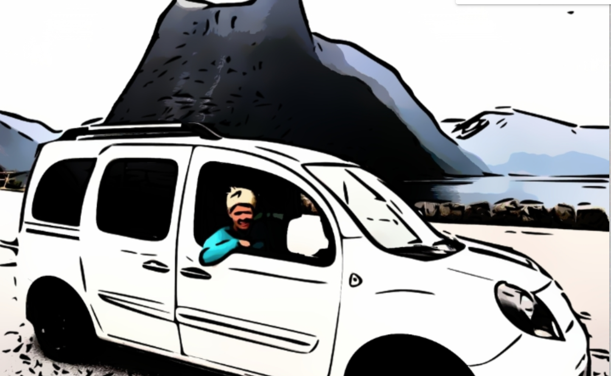

# blocket
Webscraping of blocket.se in the search for a new car...

First of all, don't fly when you can drive and don't drive when you 
can walk or bike, as the global temperature is rising! 
But if you like me really need a car, in my case to do longer trips 
instead of flying, here is a story about how I selected the used car 
I decided to buy.

## Install
You need Python3, and GIT.
* Clone this repo.
* Install the requirements: pip install -r [requirements.txt](requirements.txt)

## Run the webscrapping
Write a script similar to [run_updata.py](run_update.py), where you specify the 
blocket search URL:s that you are interested in. The Result will be saved in a csv file.

## Run the regression
Run a regression similar to the Jupyter Notebook: [regression.ipynb](regression.ipynb).
This fits a model to the data to predict the price of the cars. 
The cars are then rated based on how much cheaper or more expensive they are compared to this model.  

